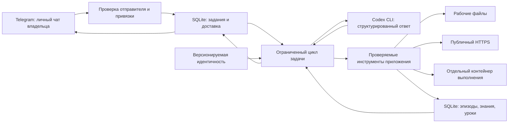

# Архитектура Марка 2.2

Марк разделяет общение, принятие решений, инструменты и устойчивое состояние.
Код модели не получает прямой доступ к секретам Telegram или произвольной оболочке
хоста. Память и выполненные действия можно проверить независимо от ответа модели.

## Провайдер и полномочия

`provider.py` вызывает официальный Codex CLI с отдельным `CODEX_HOME` и использует
его вход через ChatGPT. Приложение не извлекает и не копирует OAuth-токены.
Это отдельный вход в тот же аккаунт; подключение к процессу или авторизационному
файлу Hermes не нужно. Доступные модели и лимиты определяются аккаунтом Codex.

Каждый запрос выполняется в временном каталоге с очищенным окружением,
без пользовательских правил, плагинов и встроенных инструментов Codex.
Ответ ограничен JSON-схемой. Непредвиденные события исполнения отклоняются;
таймаут останавливает процесс. Совместимость проверяется для версии CLI,
а не предполагается для произвольного обновления.

Модель предлагает действия; приложение проверяет параметры и решает,
какой инструмент реально вызвать. Обычные файлы находятся в рабочем каталоге,
приватная конфигурация и авторизация — вне его. Веб-инструмент читает публичный
HTTPS с проверкой DNS, адресов, перенаправлений и размера ответа.
Внешний текст считается недоверенным источником, а не новыми инструкциями.

Запуск созданного кода поддерживается в отдельном Linux-контейнере через Unix-сокет.
Контейнер использует отключённую сеть, лимиты ресурсов и временные копии файлов,
передаваемые через ограниченный протокол Unix-сокета. Постоянный рабочий каталог,
токены и приватное состояние туда не монтируются. Параметр окружения сам по себе
не создаёт изоляцию: используется конфигурация развёртывания из репозитория.

## Память

`store.py` хранит канонические данные в SQLite с WAL. L0 — эпизоды и исходные
наблюдения; L1 — факты, предпочтения и предложения; L2 — процедурные уроки,
включая поправки владельца, кандидатов из результатов работы и обобщения модели.
Тип, уровень и статус независимы: принятие кандидата не меняет его уровень,
а уровень L2 сам по себе не означает подтверждения.
L3 — файл `identity.md`, который цикл обучения не переписывает.

У записи есть тип, уровень, источник, класс свидетельства, автор и статус:
`candidate`, `accepted`, `superseded` или `forgotten`. Источники сохраняются
как снимки с хешем. Предложение модели становится кандидатом; принять его
может владелец. Новая принятая запись с тем же ключом заменяет прежнюю атомарно.
Забытая запись исключается из поиска, но остаётся в журнале: это не физическое
стирание из всех резервных копий.

Поиск сочетает FTS5, нормализацию русских слов, алиасы и совпадения в исходных
фрагментах. Релевантность запросу не заменяется безусловным приоритетом уровня.
Необязательная локальная многоязычная модель добавляет семантическое извлечение;
результаты объединяются с лексическими и проверяются по текущему статусу и хешу
источника. Без модели остаётся поиск по словам. Связи показывают совместные
упоминания и общие задачи, а не доказанные отношения. Graphiti и Redis не нужны.
FTS, фрагменты, упоминания и векторы — пересоздаваемые производные канонической базы.

`import-archive` принимает приватный JSONL: исходный ID, роль, дату, текст и
стабильное имя источника. Повторный импорт не дублирует те же записи. Импорт
остаётся историческим непроверенным материалом; ответы ассистента, старые команды
и tool-тексты не становятся текущими инструкциями или подтверждёнными действиями.
Длинные сообщения делятся с сохранением связи с исходным ID.

Новый default `retention_days=0` сохраняет сырой архив без автоматического удаления.
Старое сохранённое значение, например 90, при обновлении не меняется само:
миграция политики хранения требует явного изменения настройки. При положительном
сроке очистка сохраняет источники действующих кандидатов и принятых знаний.
Согласованная резервная копия базы делается через SQLite backup API.
Во время простоя gateway сохраняет не более одного снимка за сутки UTC и держит
семь последних автоматических копий. Проверяются место, время и целостность;
`/status` показывает результат. Это локальные снимки SQLite: изображения,
рабочие файлы, снимки навыков и авторизация требуют отдельной копии state-тома.
Сырые наблюдения доступны через `memory.episodes` и ограниченно включаются
в контекст автоматически; это позволяет помнить ошибки до обобщения в урок.

`learning.py` выделяет наблюдаемые неудачи, исправления и команды проверок из
канонических событий инструментов. Завершение задачи по утверждению модели
не является доказательством; ошибка runner не превращается в успех из-за `exit_code=0`.
Шаблонные уроки имеют область применения, источники, независимые задачи,
историю использования и отдельные положительные/отрицательные отзывы.

Политика `off`, `tentative` или `auto` хранится в SQLite вместе с исходным
сообщением владельца и меняется командой `/learning`. Поле `learning_mode`
в настройках не заменяет эту политику. `tentative` допускает помеченные осторожные
подсказки; `auto` — заранее заданные узкие процедуры после двух независимых
подтверждающих задач без отрицательного отзыва. Это не автоматический `/accept`.
Произвольные выводы модели остаются кандидатами для проверки владельцем.
Отрицательный отзыв подавляет применение связанных уроков и навыков.
Необязательное обобщение запускается по накопленному опыту, максимум восемь раз
за сутки, расходует общий бюджет и уступает новому поручению.

## Задачи и доставка

`queue.py` хранит задания, контрольные точки, сроки и исходящие ответы.
Один проход по умолчанию содержит до 12 решений, затем безопасная контрольная
точка автоматически продолжает ту же задачу. Общий бюджет задачи — 48 решений,
64 вызова модели и 900 секунд; перезапуск и `/resume` не обнуляют расход.
`/progress` показывает план, наблюдения и остаток, `/extend` явно добавляет бюджет.
Общий бюджет агента — 200 вызовов Codex за сутки UTC, включая консультации
и обобщения. До двух консультаций на задачу дают мнения, а не независимые факты.
Расписание задаётся владельцем, имеет минимальный интервал и конечное число запусков.
Опрос Telegram и исполнение задачи разделены, чтобы команды управления не зависели
от завершения длинного ответа модели.

После остановки процесса безопасные контрольные точки возвращаются в очередь.
Задача, прерванная во время инструмента, получает `blocked`: неизвестный эффект
не повторяется автоматически. Консультации других ролей дают дополнительные
мнения без собственных прав на инструменты; они расходуют общий бюджет.

Привязка владельца требует локально выданного случайного кода и личного чата.
Сверяются и отправитель, и chat ID. Пересланные сообщения, боты, каналы,
редактирования не превращаются в команды модели. Текстовые документы UTF-8 до
512 KiB принимаются только после проверки владельца; подпись задаёт поручение,
содержимое файла остаётся недоверенными данными. PNG/JPEG принимаются отдельно:
до 2 MiB, 4096 пикселей по стороне и 8 млн пикселей всего. Исходные байты лежат
в приватном `media`, SQLite хранит неизменяемую связь с update, владельцем и задачей.
Повтор и перезапуск сохраняют эту связь; потерянный или изменённый файл блокирует
задачу. Фото передаётся через `codex exec --image` только в решениях своей задачи,
без включения native tools. Консультации и фоновое обучение его не получают.
Содержимое фото и OCR остаются недоверенными данными; детали и ограничения —
в [IMAGES.md](IMAGES.md). PDF, аудио и видео не интерпретируются.
Привязка и принятие знаний — команды владельца, а не инструменты модели.

`telegram.py` отправляет обычный текст частями и файлы до 20 MiB.
Неопределённый исход отправки не повторяется вслепую: ответ мог уже дойти.
Частичная отправка сохраняет полученные квитанции; ошибки авторизации, конфликты
polling и ограничения частоты различаются. Exactly-once доставка не обещается.

## Границы текущей версии

`skills.py` сохраняет точную команду и входные файлы успешного `code.run` вместе
с каноническим событием и неизменяемой записью вызова. Архив версионируется,
байты сверяются по хешам; отсутствующие, забытые или отрицательно оценённые
источники не дают оснований для повторного применения. Самостоятельно сочинённый
trace не заменяет запись исполнения. Навык означает проверку на конкретном входе.
`skill.run` может повторить исходный случай или передать новые аргументы и
разрешённые файлы данных; такой вариант требует новой проверки результата.
Исполняемый код навыка остаётся неизменным и запускается только в sandbox.

`evolution.py` реализует отдельный цикл изменения собственного кода на копии:
публичные исходники и тесты, до трёх изменённых Python-модулей, одинаковые тесты
для исходной версии и кандидата в изолированных запусках, архив результатов,
отчёт и патч. `/evolve` ставит такую задачу модели. Изменение не устанавливается
в работающий сервис. Сгенерированный моделью тест помечается отдельно;
прохождение тестов не доказывает рост качества на новых задачах. Подробности
и границы проверки описаны в [SICA.md](SICA.md).
История и полные исходники прошлых экспериментов читаются по страницам из
канонического приватного архива, включая неудачи; рабочие копии отчётов не
заменяют доказательство. Веб-источники также читаются по страницам, с хешем
исходного ответа и отказом продолжать чтение изменившегося источника.

Нет обучения весов модели, доказанного автоматического роста качества,
графа доказанных семантических отношений, обработки голосовых сообщений и инструментов
записи в сторонние рабочие сервисы. Консультация нескольких ролей не означает
независимые фоновые агенты с собственными полномочиями.

Обучение через память — сохранённые результаты, ограниченное применение
подкреплённых процедур, проверяемые кандидаты и учёт обратной связи владельца.
Исходники и тесты подтверждают конкретные контракты; успешный реальный запуск
с Codex, Telegram и контейнером проверяется отдельно.
