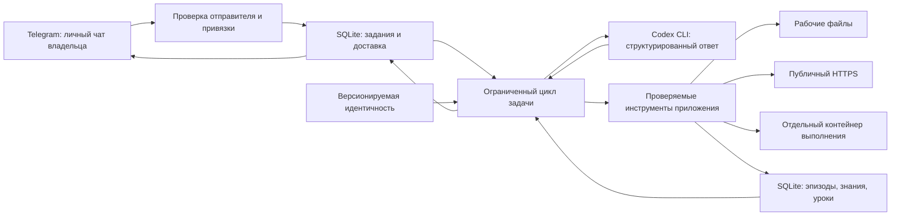

# Архитектура Марка

Марк разделяет общение, принятие решений, инструменты и устойчивое состояние.
Код модели не получает прямой доступ к секретам Telegram или произвольной оболочке
хоста. Память и выполненные действия можно проверить независимо от ответа модели.

## Провайдер и полномочия

`provider.py` вызывает официальный Codex CLI с отдельным `CODEX_HOME` и использует
его вход через ChatGPT. Приложение не извлекает и не копирует OAuth-токены.
Это отдельный вход в тот же аккаунт; подключение к процессу или авторизационному
файлу Hermes не нужно. Доступные модели и лимиты определяются аккаунтом Codex.

Каждый запрос выполняется в временном каталоге с очищенным окружением,
без пользовательских правил, плагинов и встроенных инструментов Codex.
Ответ ограничен JSON-схемой. Непредвиденные события исполнения отклоняются;
таймаут останавливает процесс. Совместимость проверяется для версии CLI,
а не предполагается для произвольного обновления.

Модель предлагает действия; приложение проверяет параметры и решает,
какой инструмент реально вызвать. Обычные файлы находятся в рабочем каталоге,
приватная конфигурация и авторизация — вне его. Веб-инструмент читает публичный
HTTPS с проверкой DNS, адресов, перенаправлений и размера ответа.
Внешний текст считается недоверенным источником, а не новыми инструкциями.

Запуск созданного кода поддерживается в отдельном Linux-контейнере через Unix-сокет.
Контейнер использует отключённую сеть, лимиты ресурсов и временные копии файлов,
передаваемые через ограниченный протокол Unix-сокета. Постоянный рабочий каталог,
токены и приватное состояние туда не монтируются. Параметр окружения сам по себе
не создаёт изоляцию: используется конфигурация развёртывания из репозитория.

## Память

`store.py` хранит канонические данные в SQLite с WAL. L0 — эпизоды, L1 — факты,
предпочтения и предложения модели, L2 — уроки владельца через `/learn` и знания,
явно размеченные этим уровнем при импорте. Тип записи и уровень независимы:
например, принятие предложенного моделью урока сохраняет его исходный L1.
L3 — файл `identity.md`, который цикл обучения не переписывает.

У записи есть тип, уровень, источник, класс свидетельства, автор и статус:
`candidate`, `accepted`, `superseded` или `forgotten`. Источники сохраняются
как снимки с хешем. Предложение модели становится кандидатом; принять его
может владелец. Новая принятая запись с тем же ключом заменяет прежнюю атомарно.
Забытая запись исключается из поиска, но остаётся в журнале: это не физическое
стирание из всех резервных копий.

Поиск использует FTS5 и лексические совпадения, с приоритетом более высоких уровней.
Это не семантический или графовый поиск. Для базовой работы не нужны Graphiti,
Redis, отдельные векторные индексы или платный API эмбеддингов.
Очистка старых эпизодов сохраняет источники действующих кандидатов и принятых знаний.
Резервная копия делается через SQLite backup API.
Сырые наблюдения доступны через `memory.episodes` и ограниченно включаются
в контекст автоматически; это позволяет помнить ошибки до обобщения в урок.

## Задачи и доставка

`queue.py` хранит задания, контрольные точки, сроки и исходящие ответы.
Задание ограничено количеством шагов и суточным бюджетом вызовов провайдера.
Расписание задаётся владельцем, имеет минимальный интервал и конечное число запусков.
Опрос Telegram и исполнение задачи разделены, чтобы команды управления не зависели
от завершения длинного ответа модели.

После остановки процесса безопасные контрольные точки возвращаются в очередь.
Задача, прерванная во время инструмента, получает `blocked`: неизвестный эффект
не повторяется автоматически. Консультации других ролей дают дополнительные
мнения без собственных прав на инструменты; они расходуют общий бюджет.

Привязка владельца требует локально выданного случайного кода и личного чата.
Сверяются и отправитель, и chat ID. Пересланные сообщения, боты, каналы,
редактирования и нетекстовые сообщения не превращаются в команды модели.
Привязка и принятие знаний — команды владельца, а не инструменты модели.

`telegram.py` отправляет обычный текст частями и файлы до 20 MiB.
Неопределённый исход отправки не повторяется вслепую: ответ мог уже дойти.
Частичная отправка сохраняет полученные квитанции; ошибки авторизации, конфликты
polling и ограничения частоты различаются. Exactly-once доставка не обещается.

## Границы текущей версии

`evolution.py` реализует отдельный цикл изменения собственного кода на копии:
публичные исходники и тесты, до трёх изменённых Python-модулей, одинаковые тесты
для исходной версии и кандидата в изолированных запусках, архив результатов,
отчёт и патч. `/evolve` ставит такую задачу модели. Изменение не устанавливается
в работающий сервис. Сгенерированный моделью тест помечается отдельно;
прохождение тестов не доказывает рост качества на новых задачах. Подробности
и границы проверки описаны в [SICA.md](SICA.md).

Нет обучения весов модели, доказанного автоматического роста качества,
семантического графового поиска, обработки голосовых сообщений и инструментов
записи в сторонние рабочие сервисы. Консультация нескольких ролей не означает
независимые фоновые агенты с собственными полномочиями.

Обучение через память — сохранённые результаты, проверяемые предложения уроков,
подтверждение владельцем и извлечение этих уроков в следующих задачах.
Исходники и тесты подтверждают конкретные контракты; успешный реальный запуск
с Codex, Telegram и контейнером проверяется отдельно.
