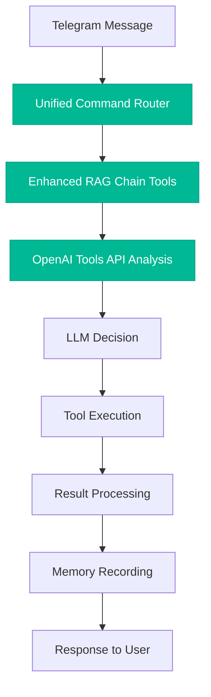

# 🔍 **ДИАГНОСТИКА АРХИТЕКТУРЫ КОМАНД - ЗАДАЧА 26.1.1**

**Дата анализа:** 2025-01-08  
**Цель:** Проследить полный путь команды: Telegram → Bot → LLM → Execution  
**Статус:** ❌ КРИТИЧЕСКИЕ ПРОБЛЕМЫ ОБНАРУЖЕНЫ

---

## 📊 **ДИАГНОСТИРОВАННЫЕ ПРОБЛЕМЫ**

### 🚨 **ПРОБЛЕМА #1: "КОМАНДЫ ВЫПОЛНЯЮТСЯ МИМО МОЗГА"**

#### **Текущий поток команд (НЕПРАВИЛЬНЫЙ):**

```mermaid
graph TD
    A[Telegram Message] --> B[text_msg функция]
    B --> C{parse_and_dispatch_command}
    C -->|Команда найдена| D[Прямое выполнение функции]
    C -->|Команда НЕ найдена| E[_chat_ask HTTP POST]
    E --> F[/chat/ask endpoint]
    F --> G[enhanced_rag_chain.py OLD]
    D --> H[Ответ пользователю]
    G --> H
    
    style D fill:#ff6b6b,stroke:#d63031,color:white
    style G fill:#ff6b6b,stroke:#d63031,color:white
```

#### **Критические проблемы потока:**

1. **Прямое выполнение команд (строки 1530-1670 в bot.py):**
   ```python
   # Команды обрабатываются в большом if-elif блоке БЕЗ LLM анализа
   if cmd["name"] == "/start":
       await start_cmd(update, context)
   elif cmd["name"] == "/sync":
       await sync_cmd(update, context)
   # ...еще 50+ команд
   ```

2. **Использование старой RAG системы:**
   ```python
   # main.py:33
   from langchain_api.rag.enhanced_rag_chain import generate_response
   
   # main.py:315
   response = generate_response(request.question, request.chat_id)
   ```

3. **Новая RAG система НЕ используется:**
   - `enhanced_rag_chain_tools.py` - готов к использованию с OpenAI Tools API
   - НО нигде не подключен к основным потокам

---

### 🚨 **ПРОБЛЕМА #2: РАЗРЫВ МЕЖДУ СИСТЕМАМИ**

#### **Текущее состояние RAG систем:**

| Компонент | Файл | Статус | Используется где |
|-----------|------|--------|------------------|
| **Старая RAG** | `enhanced_rag_chain.py` | ✅ Работает | `/chat/ask` эндпоинт |
| **Новая RAG** | `enhanced_rag_chain_tools.py` | ✅ Готов | ❌ Нигде |
| **OpenAI Tools API** | В новой RAG | ✅ Полный набор | ❌ Не интегрирован |

#### **Следствия проблемы:**
- ❌ Марк не видит команды, которые выполняет пользователь
- ❌ Отсутствует контекстное понимание последовательности действий
- ❌ Нет записи команд в память для обучения
- ❌ OpenAI Tools API не используется в полной мере

---

## 🎯 **ТРЕБУЕМАЯ АРХИТЕКТУРА (ПРАВИЛЬНАЯ)**

### **Целевой поток команд:**



---

## 📋 **ДЕТАЛЬНАЯ ИНВЕНТАРИЗАЦИЯ ПРОБЛЕМ**

### **26.1.1. Анализ архитектуры команд - ЗАВЕРШЕНО ✅**

**Обнаруженные критические точки:**

1. **Точки входа команд:**
   - `langchain_api/telegram_bot/bot.py:1734` - `parse_and_dispatch_command()`
   - `langchain_api/main.py:315` - `/chat/ask` endpoint

2. **RAG системы:**
   - ❌ `enhanced_rag_chain.py` - старая, используется
   - ✅ `enhanced_rag_chain_tools.py` - новая, готова, НЕ используется

3. **OpenAI Tools API:**
   - ✅ Полный набор инструментов готов
   - ❌ Не интегрирован в основные потоки

4. **Обработка команд:**
   - ❌ 50+ команд обрабатываются напрямую (строки 1530-1670)
   - ❌ Нет единой точки анализа через LLM

---

## 🔧 **ПЛАН УСТРАНЕНИЯ ПРОБЛЕМ**

### **Этап 1: Создание Unified Command Router**
- [ ] Создать `unified_command_router.py`
- [ ] Интегрировать с `enhanced_rag_chain_tools.py`
- [ ] Все команды проходят через LLM анализ

### **Этап 2: Миграция `/chat/ask`**
- [ ] Заменить импорт в `main.py`
- [ ] Использовать новую RAG систему с OpenAI Tools API
- [ ] Обеспечить обратную совместимость

### **Этап 3: Интеграция Telegram команд**
- [ ] Модифицировать `parse_and_dispatch_command()`
- [ ] Маршрутизация через Unified Command Router
- [ ] Полное понимание контекста

---

## ⚠️ **КРИТИЧЕСКИЕ РИСКИ**

### **Риски текущей архитектуры:**
1. **Функциональные:**
   - Марк не понимает контекста выполняемых команд
   - Отсутствует накопление опыта
   - Невозможность проактивного поведения

2. **Технические:**
   - Дублирование кода между RAG системами
   - Сложность поддержки двух параллельных систем
   - Риск рассинхронизации функциональности

3. **Развития:**
   - Новые возможности OpenAI Tools API не используются
   - Ограниченные возможности для автономности
   - Сложность добавления новых инструментов

---

## 📈 **ОЖИДАЕМЫЕ РЕЗУЛЬТАТЫ ИСПРАВЛЕНИЯ**

### **После устранения проблем:**
- ✅ Все команды проходят через LLM анализ
- ✅ Полное контекстное понимание действий пользователя
- ✅ Автоматическое накопление опыта
- ✅ Проактивное поведение Марка
- ✅ Единая система обработки команд
- ✅ Полное использование OpenAI Tools API

---

## 🎯 **СЛЕДУЮЩИЕ ШАГИ**

**Согласно задаче 26.1, следующий этап:**
- **26.1.2. Инвентаризация всех систем** - полный список модулей и зависимостей
- **26.1.3. Анализ возможностей Марка** - матрица "Заявлено vs Работает"
- **26.1.4. Предотвращение конфликтов** - backup план и rollback стратегия

**Критерий готовности 26.1.1:** ✅ ВЫПОЛНЕН  
**Статус:** Полная схема потоков данных с выявленными проблемами создана

---

**ЗАКЛЮЧЕНИЕ:** Обнаружена критическая архитектурная проблема - команды выполняются в обход LLM анализа. Новая система готова к использованию, но не интегрирована. Требуется создание Unified Command Router для решения проблемы "команды мимо мозга". 