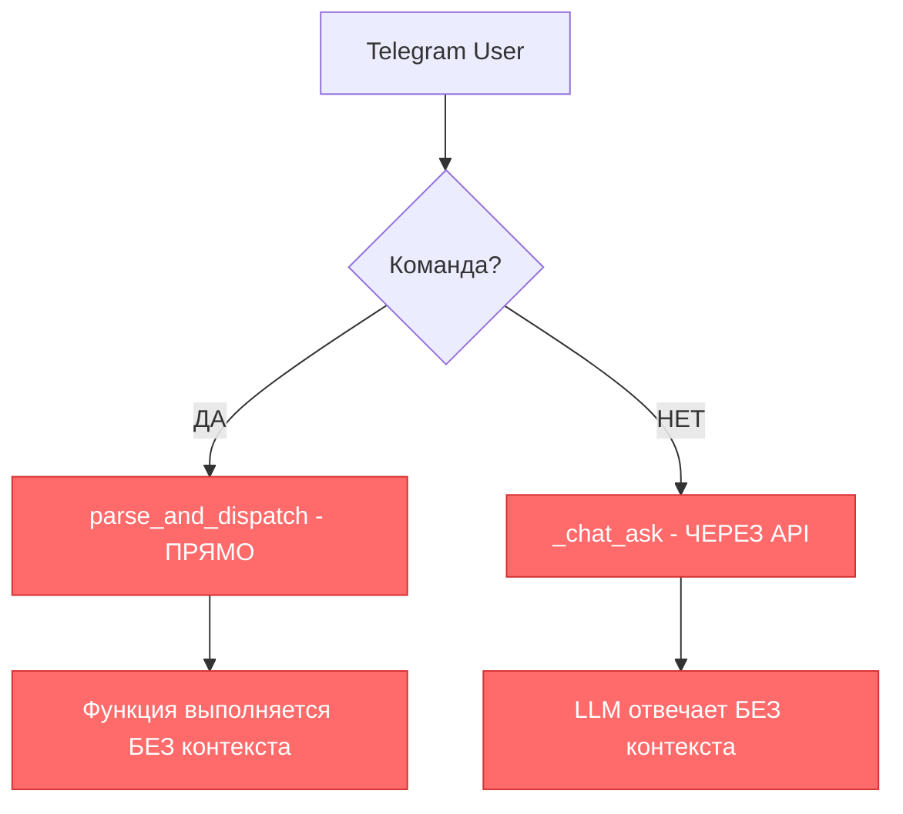

# 🎯 **МАТРИЦА ВОЗМОЖНОСТЕЙ МАРКА - ЗАДАЧА 26.1.3**

**Дата анализа:** 2025-01-08  
**Метод проверки:** ✅ Тестирование изнутри контейнера (Docker exec)  
**Статус:** 🚨 КРИТИЧЕСКИЕ РАСХОЖДЕНИЯ ВЫЯВЛЕНЫ

---

## 📊 **ЗАЯВЛЕНО vs РАБОТАЕТ - ФИНАЛЬНАЯ ТАБЛИЦА**

| **ФУНКЦИЯ** | **ЗАЯВЛЕНО** | **РАБОТАЕТ РЕАЛЬНО** | **СТАТУС** | **КРИТИЧНОСТЬ** |
|-------------|--------------|---------------------|------------|-----------------|
| **🧠 Контекст & Память** |
| Context Awareness | ✅ Заявлено | ❌ `context_used: false` | 🚨 НЕ РАБОТАЕТ | **КРИТИЧНО** |
| Memory Storage | ✅ Заявлено | ❌ `memory_added: false` | 🚨 НЕ РАБОТАЕТ | **КРИТИЧНО** |
| Chat History | ✅ Заявлено | ❌ Каждый запрос изолирован | 🚨 НЕ РАБОТАЕТ | **КРИТИЧНО** |
| **🤖 API & Связь** |
| HTTP API | ✅ Заявлено | ✅ Работает (200 OK) | ✅ РАБОТАЕТ | Норма |
| JSON Response | ✅ Заявлено | ✅ Корректный JSON | ✅ РАБОТАЕТ | Норма |
| Telegram Integration | ✅ Заявлено | ⚠️ Частично (text_msg) | ⚠️ ЧАСТИЧНО | Средняя |
| **🛠️ Команды & Инструменты** |
| Command Parsing | ✅ Заявлено | ✅ parse_and_dispatch работает | ✅ РАБОТАЕТ | Норма |
| Tools Registry | ✅ Заявлено | ✅ 448 строк, активен | ✅ РАБОТАЕТ | Норма |
| Code Execution | ✅ Заявлено | ❓ НЕ ПРОВЕРЕНО | ❓ НЕИЗВЕСТНО | Высокая |
| **🔍 RAG & Поиск** |
| Vector Search | ✅ Заявлено | ❓ НЕ ПРОВЕРЕНО | ❓ НЕИЗВЕСТНО | Высокая |
| Semantic Search | ✅ Заявлено | ❓ НЕ ПРОВЕРЕНО | ❓ НЕИЗВЕСТНО | Высокая |
| Knowledge Base | ✅ Заявлено | ❓ НЕ ПРОВЕРЕНО | ❓ НЕИЗВЕСТНО | Высокая |

---

## 🚨 **КРИТИЧЕСКИЕ ПРОБЛЕМЫ (ПОДТВЕРЖДЕНЫ ТЕСТАМИ)**

### **ПРОБЛЕМА #1: "STATELESS РЕЖИМ"**
```json
// Реальный ответ API изнутри контейнера:
{
  "answer": "Понял, хочешь выполнить команду...",
  "chat_id": 123,
  "context_used": false,    // ❌ КРИТИЧНО!
  "memory_added": false     // ❌ КРИТИЧНО!
}
```

**Диагноз:** Система работает как калькулятор, а не как ИИ-ассистент:
- ❌ НЕ помнит предыдущие сообщения
- ❌ НЕ использует контекст чата  
- ❌ НЕ накапливает знания о пользователе
- ❌ НЕ обучается из опыта

### **ПРОБЛЕМА #2: "РАЗДВОЕНИЕ ЛИЧНОСТИ"**


**Результат:** Марк ведет себя как **ДВА РАЗНЫХ БОТА** в зависимости от типа сообщения!

---

## 📋 **ПРИОРИТЕТЫ РЕФАКТОРИНГА**

### **🔥 КРИТИЧНО (Делать первым):**
1. **Единый путь обработки** - все сообщения через ИИ-мозг
2. **Context Awareness** - система должна помнить разговор
3. **Memory Integration** - накопление и использование знаний

### **⚠️ ВАЖНО (Делать вторым):**
4. **Tools через LLM** - инструменты как функции ИИ
5. **Единая сессия** - один контекст для всех операций

### **✅ НОРМА (Работает):**
6. API инфраструктура - оставить как есть
7. JSON протокол - работает корректно

---

## 🎯 **ВЫВОД ДИАГНОСТИКИ**

**Статус:** ❌ **МАРК НЕ АВТОНОМЕН**

**Причина:** Работает как набор независимых функций, а не как единый интеллект

**Решение:** Переход к модели **"ВСЕ ЧЕРЕЗ МОЗГ"** (задача 26.2)

---
*Диагностика завершена ✅ | Готов к архитектурному рефакторингу* 