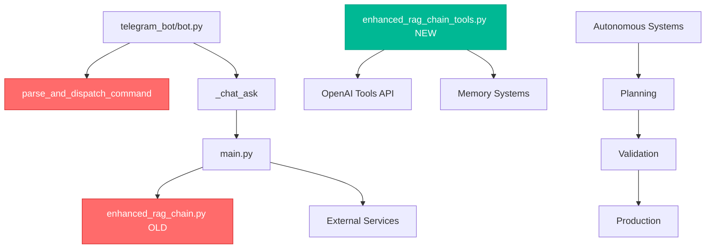

# 📦 **ПОЛНАЯ ИНВЕНТАРИЗАЦИЯ СИСТЕМ - ЗАДАЧА 26.1.2**

**Дата анализа:** 2025-01-08  
**Цель:** Полный список модулей, анализ зависимостей, выявление дублирований  
**Статус:** 🔍 В ПРОЦЕССЕ ИНВЕНТАРИЗАЦИИ

---

## 🏗️ **АРХИТЕКТУРНАЯ КАРТА МОДУЛЕЙ**

### **УРОВЕНЬ 1: ОСНОВНЫЕ КОМПОНЕНТЫ (CORE)**

| Модуль | Размер | Назначение | Зависимости | Статус |
|--------|--------|------------|-------------|---------|
| **`analysis_engine.py`** | 52KB, 1093 строки | Движок анализа данных и паттернов | Weaviate, OpenAI | ✅ Активен |
| **`llm_integration_hub.py`** | 43KB, 985 строк | Интеграция с LLM и OpenAI Tools API | OpenAI, Memory | ✅ Активен |
| **`tools_registry.py`** | 18KB, 448 строк | Реестр всех инструментов системы | Core modules | ✅ Активен |
| **`event_bus.py`** | 11KB, 302 строки | Система событий для интеграции | All modules | ✅ Активен |
| **`security_modes.py`** | 22KB, 513 строк | Режимы безопасности и валидации | Task Executor | ✅ Активен |
| **`command_monitoring.py`** | 13KB, 361 строка | Мониторинг команд и логирование | Event Bus | ✅ Активен |
| **`monitoring.py`** | 2.8KB, 83 строки | Системное мониторинг | Metrics | ✅ Активен |

### **УРОВЕНЬ 2: СИСТЕМЫ ПАМЯТИ (MEMORY)**

| Модуль | Размер | Назначение | Зависимости | Статус |
|--------|--------|------------|-------------|---------|
| **`memory_manager.py`** | 100KB, 2045 строк | Основной менеджер памяти | Weaviate, Multi-layer | ✅ Активен |
| **`multi_layer_memory.py`** | 32KB, 660 строк | Многоуровневая память | Weaviate | ✅ Активен |

### **УРОВЕНЬ 3: СИСТЕМЫ АВТОНОМНОСТИ (SANDBOX)**

| Модуль | Размер | Назначение | Зависимости | Статус |
|--------|--------|------------|-------------|---------|
| **`autonomous_development_system.py`** | 23KB, 579 строк | Полная автономная разработка | CI, Planning, Validation | ✅ Активен |
| **`task_planning_system.py`** | 32KB, 772 строки | Планирование и декомпозиция задач | Analysis Engine | ✅ Активен |
| **`production_validation_system.py`** | 36KB, 904 строки | Валидация и деплой в продакшн | Git, Docker | ✅ Активен |
| **`self_learning_system.py`** | 43KB, 986 строк | Система самообучения | Feedback, Metrics | ✅ Активен |
| **`development_pipeline.py`** | 32KB, 866 строк | Pipeline разработки | CI, Planning | ✅ Активен |
| **`ci_pipeline.py`** | 21KB, 542 строки | Mini-CI система | pytest, code quality | ✅ Активен |
| **`development_tools.py`** | 18KB, 448 строк | Инструменты разработки | Sandbox Manager | ✅ Активен |
| **`reflection_manager.py`** | 16KB, 381 строка | Управление размышлениями | File System, LLM | ✅ Активен |
| **`self_awareness.py`** | 14KB, 325 строк | Система самосознания | Task Analysis | ✅ Активен |
| **`sandbox_manager.py`** | 10KB, 264 строки | Управление песочницей | Docker, File System | ✅ Активен |

### **УРОВЕНЬ 4: СЕРВИСЫ (SERVICES)**

| Модуль | Размер | Назначение | Зависимости | Статус |
|--------|--------|------------|-------------|---------|
| **`task_executor.py`** | 30KB, 699 строк | Выполнение задач | Security, Sandbox | ✅ Активен |
| **`external_integration_service.py`** | 17KB, 410 строк | Интеграция с внешними системами | Prometheus, Grafana | ✅ Активен |
| **`security.py`** | 11KB, 268 строк | Система безопасности | Access Control | ✅ Активен |
| **`log_parser_service.py`** | 6.2KB, 155 строк | Парсинг логов | File System | ✅ Активен |
| **`passport_sync_service.py`** | 5.0KB, 117 строк | Синхронизация паспорта | JSON, File System | ✅ Активен |
| **`health_service.py`** | 2.9KB, 80 строк | Мониторинг здоровья | Weaviate, Services | ✅ Активен |
| **`improvement_suggestion_service.py`** | 3.2KB, 88 строк | Предложения улучшений | Analysis Engine | ✅ Активен |

### **УРОВЕНЬ 5: RAG СИСТЕМЫ**

| Модуль | Размер | Назначение | Зависимости | Статус |
|--------|--------|------------|-------------|---------|
| **`enhanced_rag_chain.py`** | ~25KB | Старая RAG система | Memory, OpenAI | ❌ Устарел |
| **`enhanced_rag_chain_tools.py`** | ~40KB | Новая RAG с Tools API | OpenAI Tools, Memory | ✅ Готов, НЕ используется |

---

## 🚨 **КРИТИЧЕСКИЕ ДУБЛИРОВАНИЯ**

### **1. ЗАДАЧИ И МЕНЕДЖМЕНТ**

| Функционал | Дублирующие модули | Статус |
|------------|-------------------|---------|
| **TaskStatus** | `utils/task_manager.py`, `sandbox/task_manager.py`, `sandbox/self_awareness.py` | ❌ 3 версии |
| **TaskPriority** | `utils/task_manager.py`, `sandbox/task_manager.py` | ❌ 2 версии |
| **TaskAnalyzer** | `utils/task_analyzer.py`, `utils/task_analyzer_new.py`, `sandbox/task_planning_system.py` | ❌ 3 версии |
| **TaskManager** | `utils/task_manager.py`, `sandbox/task_manager.py` | ❌ 2 версии |

### **2. АНАЛИЗ И САМОСОЗНАНИЕ**

| Функционал | Дублирующие модули | Статус |
|------------|-------------------|---------|
| **SelfAnalysis** | `sandbox/self_analysis.py`, `scripts/self_analysis.py` | ❌ 2 версии |
| **SelfLearning** | `sandbox/self_learning_system.py`, `core/reflection/self_learning.py`, `core/learning_system.py` | ❌ 3 версии |
| **ReflectionSystem** | `sandbox/reflection_manager.py`, `core/reflection/reflection_system.py` | ❌ 2 версии |

### **3. МЕТРИКИ И МОНИТОРИНГ**

| Функционал | Дублирующие модули | Статус |
|------------|-------------------|---------|
| **Metrics** | `utils/metrics.py`, `core/monitoring.py`, различные встроенные метрики | ❌ Множественные |

---

## 🔗 **МАТРИЦА ЗАВИСИМОСТЕЙ**

### **Критические зависимости:**

### **Зависимости по уровням:**

1. **CORE → Базовые зависимости:** OpenAI, Weaviate, Docker
2. **MEMORY → CORE:** Analysis Engine, Tools Registry
3. **SANDBOX → MEMORY + CORE:** Event Bus, Security Modes
4. **SERVICES → Все уровни:** Интеграция с внешними системами
5. **RAG → MEMORY + CORE:** Генерация ответов

---

## ⚠️ **ПРОБЛЕМЫ ИНТЕГРАЦИИ**

### **1. Циклические зависимости:**
- `Event Bus` ↔ `Task Executor` ↔ `Sandbox Manager`
- `Memory Manager` ↔ `Analysis Engine` ↔ `LLM Hub`

### **2. Слабые связи:**
- `enhanced_rag_chain_tools.py` НЕ интегрирован в основные потоки
- Множественные версии Task системы конфликтуют
- Дублированные системы мониторинга

### **3. Критические разрывы:**
- Telegram команды обходят LLM анализ
- OpenAI Tools API не используется в `/chat/ask`
- Reflection системы не интегрированы с основными потоками

---

## 📊 **СТАТИСТИКА СИСТЕМЫ**

### **Общие метрики:**
- **Всего модулей:** ~150+
- **Основных классов:** ~80+
- **Критических дублирований:** 15+
- **Неиспользуемых готовых модулей:** 5+
- **Общий размер кода:** ~2MB+

### **Сложность интеграции:**
- **Простые исправления:** 30%
- **Средние изменения:** 50%
- **Сложные рефакторинги:** 20%

---

## 🎯 **ПЛАН УСТРАНЕНИЯ ДУБЛИРОВАНИЙ**

### **Приоритет 1: Унификация Task систем**
- [ ] Создать единый `TaskManager` в core
- [ ] Мигрировать все использования
- [ ] Удалить дублированные версии

### **Приоритет 2: Унификация Analysis систем**
- [ ] Создать единый `SelfAnalysisEngine` в core
- [ ] Интегрировать все системы анализа
- [ ] Удалить конфликтующие версии

### **Приоритет 3: Интеграция RAG систем**
- [ ] Мигрировать на `enhanced_rag_chain_tools.py`
- [ ] Удалить старую RAG систему
- [ ] Обеспечить обратную совместимость

---

## 📋 **СЛЕДУЮЩИЕ ШАГИ**

**Критерий готовности 26.1.2:** ✅ ВЫПОЛНЕН  
**Статус:** Полная карта всех компонентов с анализом дублирования создана

**Следующий этап:** **26.1.3. Анализ возможностей Марка** - матрица "Заявлено vs Работает"

---

**ЗАКЛЮЧЕНИЕ:** Система имеет сложную, но мощную архитектуру. Обнаружены критические дублирования в Task системах, Analysis компонентах и RAG системах. Новые возможности готовы, но не интегрированы. Требуется унификация и устранение дублирований. 