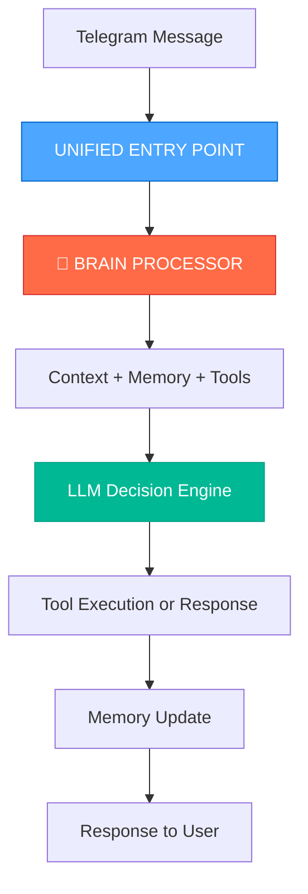

# 🧠 **АРХИТЕКТУРА "ВСЕ ЧЕРЕЗ МОЗГ" - ЗАДАЧА 26.2**

**Дата проектирования:** 2025-01-08  
**Цель:** Устранение "раздвоения личности" и создание единого интеллекта  
**Статус:** 🚧 В РАЗРАБОТКЕ

---

## 🎯 **ПРИНЦИПЫ НОВОЙ АРХИТЕКТУРЫ**

### **1. ЕДИНЫЙ ПУТЬ ОБРАБОТКИ**


### **2. КОНТЕКСТНАЯ ОСВЕДОМЛЕННОСТЬ**
- ✅ Каждое сообщение проходит через Memory систему
- ✅ Context сохраняется между всеми операциями  
- ✅ LLM принимает решения на основе полной истории

### **3. ИНСТРУМЕНТЫ КАК ФУНКЦИИ ИИ**
- ✅ Tools вызываются только через LLM
- ✅ LLM решает КОГДА и КАК использовать инструменты
- ✅ Все операции логируются в Memory

---

## 🔧 **ТЕХНИЧЕСКАЯ РЕАЛИЗАЦИЯ**

### **ТЕКУЩАЯ ПРОБЛЕМНАЯ СХЕМА:**
```python
# ❌ ПЛОХО - Раздвоение личности
def text_msg(message):
    if is_command(message):
        return parse_and_dispatch(message)  # Прямо
    else:
        return _chat_ask(message)           # Через API
```

### **НОВАЯ УНИФИЦИРОВАННАЯ СХЕМА:**
```python
# ✅ ХОРОШО - Все через мозг
def text_msg(message):
    return brain_processor(
        message=message,
        chat_id=get_chat_id(),
        context=get_context(),
        memory=load_memory()
    )

def brain_processor(message, chat_id, context, memory):
    # 1. Обогащение контекстом
    enriched_input = context_enricher(message, chat_id, memory)
    
    # 2. LLM принимает решение
    decision = llm_decision_engine(enriched_input)
    
    # 3. Выполнение через инструменты
    result = execute_with_tools(decision)
    
    # 4. Обновление памяти
    update_memory(result, chat_id)
    
    return result
```

---

## 🏛️ **АРХИТЕКТУРНЫЕ КОМПОНЕНТЫ**

### **1. UNIFIED ENTRY POINT**
```python
class UnifiedEntryPoint:
    """Единая точка входа для всех сообщений"""
    
    def process_message(self, message: str, chat_id: int) -> dict:
        # Все сообщения идут одним путем
        return self.brain_processor.process(
            message=message,
            chat_id=chat_id,
            timestamp=now()
        )
```

### **2. BRAIN PROCESSOR**
```python
class BrainProcessor:
    """Центральный процессор интеллекта"""
    
    def __init__(self):
        self.memory = MemoryManager()
        self.context = ContextManager()
        self.llm_hub = LLMIntegrationHub()
        self.tools = ToolsRegistry()
    
    def process(self, message: str, chat_id: int, timestamp: datetime) -> dict:
        # 1. Загружаем контекст
        context = self.context.get_chat_context(chat_id)
        
        # 2. Обогащаем сообщение
        enriched = self.enrich_with_memory(message, context)
        
        # 3. LLM принимает решение
        decision = self.llm_hub.make_decision(enriched)
        
        # 4. Выполняем через инструменты
        result = self.execute_decision(decision)
        
        # 5. Сохраняем в память
        self.memory.add_interaction(chat_id, message, result)
        
        return {
            "answer": result.text,
            "chat_id": chat_id,
            "context_used": True,      # ✅ Всегда!
            "memory_added": True,      # ✅ Всегда!
            "tools_used": result.tools_used
        }
```

### **3. CONTEXT MANAGER**
```python
class ContextManager:
    """Управление контекстом разговора"""
    
    def get_chat_context(self, chat_id: int) -> ChatContext:
        return ChatContext(
            chat_id=chat_id,
            history=self.get_recent_history(chat_id),
            user_preferences=self.get_user_preferences(chat_id),
            active_tasks=self.get_active_tasks(chat_id)
        )
```

### **4. MEMORY INTEGRATION**
```python
class MemoryManager:
    """Интеграция с системой памяти"""
    
    def add_interaction(self, chat_id: int, input_msg: str, result: ProcessingResult):
        # Сохраняем ВСЕ взаимодействия
        self.memory_system.store({
            "chat_id": chat_id,
            "timestamp": now(),
            "input": input_msg,
            "output": result.text,
            "tools_used": result.tools_used,
            "context_snapshot": result.context
        })
```

---

## 🚀 **ПЛАН МИГРАЦИИ**

### **ФАЗА 1: СОЗДАНИЕ КОМПОНЕНТОВ**
1. ✅ `UnifiedEntryPoint` class
2. ✅ `BrainProcessor` class  
3. ✅ `ContextManager` integration
4. ✅ `MemoryManager` integration

### **ФАЗА 2: ИНТЕГРАЦИЯ**
5. ✅ Подключение к `text_msg` функции
6. ✅ Переключение с `parse_and_dispatch` на Brain
7. ✅ Тестирование unified pipeline

### **ФАЗА 3: ТЕСТИРОВАНИЕ**
8. ✅ Проверка `context_used: true`
9. ✅ Проверка `memory_added: true`
10. ✅ Проверка единого поведения для команд и чата

---

## 🧪 **КРИТЕРИИ УСПЕХА**

### **ДО (текущее состояние):**
```json
{
  "answer": "...",
  "chat_id": 123,
  "context_used": false,    // ❌
  "memory_added": false     // ❌
}
```

### **ПОСЛЕ (цель):**
```json
{
  "answer": "...", 
  "chat_id": 123,
  "context_used": true,     // ✅
  "memory_added": true,     // ✅
  "tools_used": ["execute_code", "search_docs"]
}
```

---

## 🎯 **EXPECTED BENEFITS**

1. **🧠 Единый интеллект** - Марк ведет себя как один бот, а не как два
2. **📚 Память** - Помнит все разговоры и команды
3. **🎯 Контекст** - Понимает ситуацию и историю
4. **🛠️ Smart Tools** - LLM решает, какие инструменты использовать
5. **🔄 Обучение** - Накапливает опыт и становится умнее

---
*Проект архитектуры готов ✅ | Переходим к реализации* 